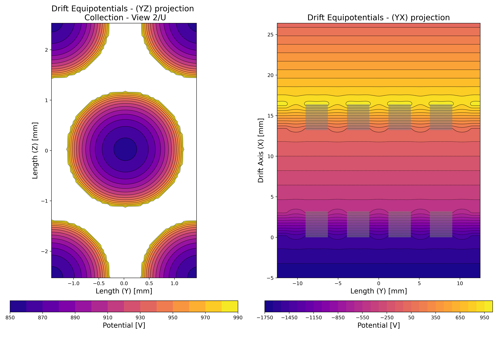
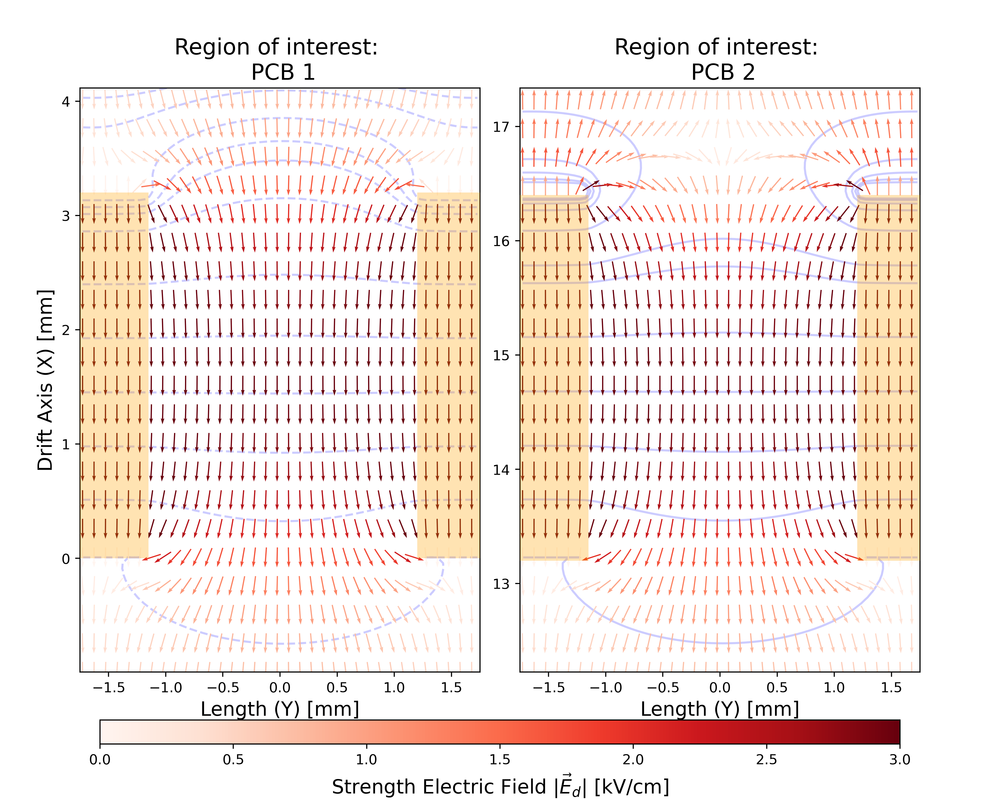

# STEAK

## How to run STEAK

Need to install the anaconda or miniconda environment. You can download it by following the link below:

https://www.anaconda.com/download

https://docs.anaconda.com/miniconda/install/

Install all libraries that you need:

`conda env create -f stenv.yml`

then : 

`conda activate stenv`

A set of default parameters is already given in (all default parameters can be modifiable):

`settings/parameters.py`

:warning: The entire simulation uses the anode geometry parameters given in this file (field calculation, electron drift and field response calculation).

The geometry of the readout plane is given in:

`settings/geometry.py`

:warning: This simulation is hardcoded to be performed with the perforated plane readout technology (can't be used for the wire chambers).

The input arguments values for simulation can be modified in:
`settings/args.py`

## Field STEAK

To launch <b>drift field calculation</b>, run:

`python drift.py` 

with the following arguments: 

* `-conv` sets the stopping criterion for the finite difference method  , (default: 0.1 V)
* `-namefile` specifies the name of the output file (default: 'drift')
* `-s` provides an input setup as a JSON file (default parameters are used if not specified)
* `-o` set to True or False to save output .txt and .json files with all parameters used (default: True)

To launch <b>drift field visualization</b>, run:
`python plotting/plot_driftfield.py` 

To launch <b>weighting field calculation</b>, run:

`python weighting.py` 

with the following arguments: 

* `-view` : selects the induction view among ('0', '1', '2')
* `-conv` : sets the stopping criterion for the finite difference method  , (default: 0.1 V)
* `-namefile` : specifies the name of the output file (default: 'weighting')
* `-s` : provides an input setup as a JSON file (default parameters are used if not specified)
* `-o` : set to True or False to save output .txt and .json files with all parameters used (default: True)
